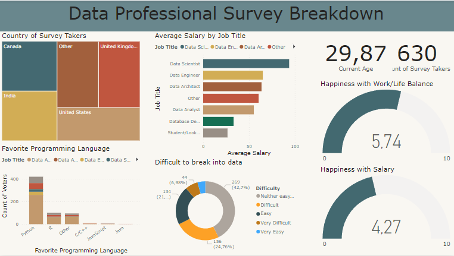

# Projeto - Power BI- Data Professional Survey Breakdown

## Introdução
Este repositório contém o projeto final, do curso de Power BI do FreeCodeCamp. O objetivo deste trabalho é realizar uma visualização de dados, utilizando Power BI. Com tratamento de dados via Power Query. 

-**Preview**: 

No proprio arquivo pbix você consegue conferir todas as alterações feitas nos dados conferindo o Power Query. E também pode conferir com mais detalhes a visualização criada.

## Equipe
- Iuri Soares

## Contribuições

Contribuições para aprimorar e expandir este projeto são bem-vindas. Se você identificar melhorias, erros ou tiver sugestões adicionais, sinta-se à vontade para abrir problemas (issues) ou enviar solicitações de pull request.
